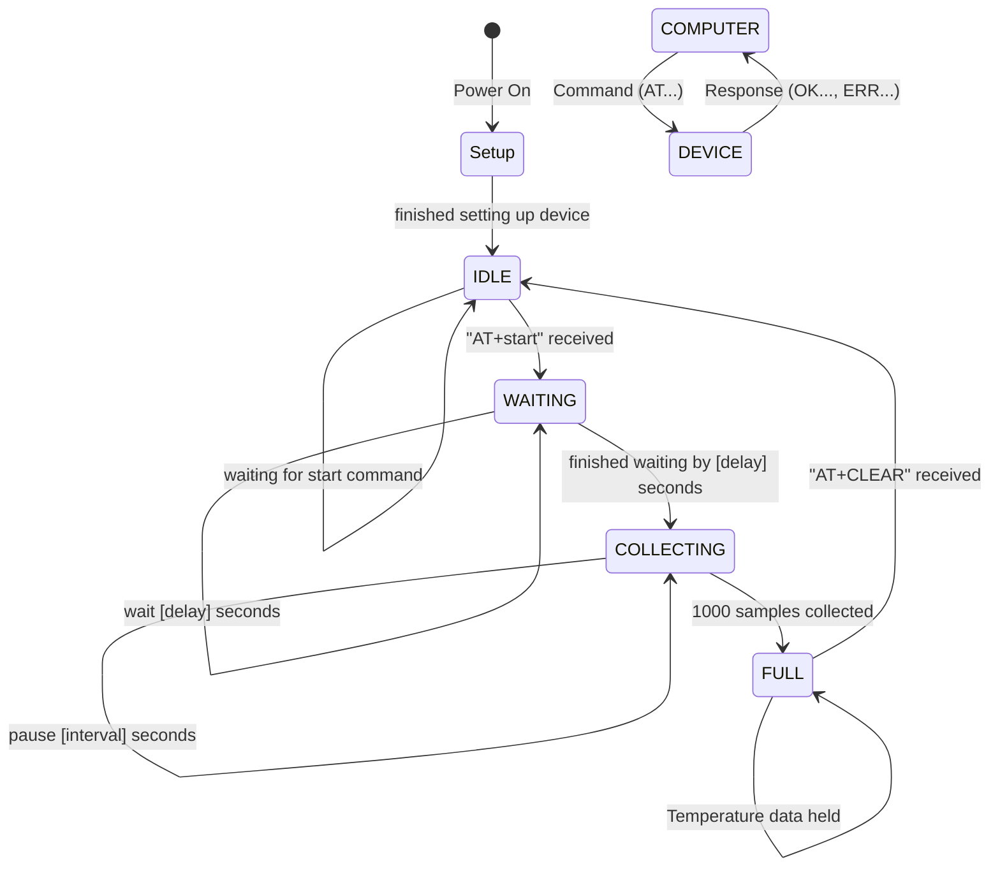

# mobile-temperature-logger

## Firmware (FW) info

### Size

Current .HEX
RAM:   [==========]  96.9% (used 2481 bytes from 2560 bytes)  
Flash: [====      ]  36.3% (used 10410 bytes from 28672 bytes)

### Initial Flash

``` bash
avrdude -c usbtiny -p atmega32u4 -U lfuse:w:0xFF:m -U hfuse:w:0xD8:m -U efuse:w:0xCB:m -U flash:w:Caterina-Feather32u4.hex
```

Microchip ATMega32u4 [datasheet pdf](https://ww1.microchip.com/downloads/en/devicedoc/atmel-7766-8-bit-avr-atmega16u4-32u4_datasheet.pdf)

### Diagramn



### VScode PIO Shortcuts

- build (ctrl+alt+b)
- upload (ctrl+alt+u)

## AT Commands

### AT Command List

1. **AT Command**: `AT`
   - **Parameters**: None
   - **Response**: `OK`
   - **Description**: Basic command to check if the device is responsive.

2. **AT Command**: `AT+TEMP@<index>`
   - **Parameters**: `<index>` - Index of the temperature telemetry value.
   - **Response**: `OK=<temperature_value>` or `ERR4` if the index is out of range.
   - **Description**: Get the temperature telemetry value at the specified index.

3. **AT Command**: `AT+TEMP#`
   - **Parameters**: None
   - **Response**: `OK=<telemetry_index>`
   - **Description**: Get the current telemetry index.

4. **AT Command**: `AT+SYNC_UTC=<utc_timestamp>`
   - **Parameters**: `<utc_timestamp>` - UTC timestamp value to synchronize.
   - **Response**: `OK=<utc_timestamp>` or `ERR4` if the timestamp is invalid.
   - **Description**: Synchronize the device's UTC timestamp.

5. **AT Command**: `AT+GET_UTC?`
   - **Parameters**: None
   - **Response**: `OK=<utc_timestamp>`
   - **Description**: Get the current UTC timestamp.

6. **AT Command**: `AT+STATE?`
   - **Parameters**: None
   - **Response**: `OK=<state>`
   - **Description**: Get the current state of the device.

7. **AT Command**: `AT+START`
   - **Parameters**: None
   - **Response**: `OK` or `ERR5` if not in the IDLE state or not synchronized with UTC.

8. **AT Command**: `AT+STOP`
   - **Parameters**: None
   - **Response**: `OK` or `ERR5` if not in the COLLECTING or WAITING_TO_START state.

9. **AT Command**: `AT+CLEAR`
   - **Parameters**: None
   - **Response**: `OK` or `ERR5` if not in the IDLE or TELM_FULL state.
   - **Description**: Clear telemetry data and reset the telemetry index.

10. **AT Command**: `AT+TEMP?`
    - **Parameters**: None
    - **Response**: `OK=<temperature_value>`
    - **Description**: Get the current temperature value.

11. **AT Command**: `AT+VBAT`
    - **Parameters**: None
    - **Response**: `OK=<battery_voltage>`
    - **Description**: Get the current battery voltage.

12. **AT Command**: `AT+VUSB`
    - **Parameters**: None
    - **Response**: `OK=<usb_voltage>`
    - **Description**: Get the current USB voltage.

13. **AT Command**: `AT+CHRG`
    - **Parameters**: None
    - **Response**: `OK=<charging_status>`
    - **Description**: Get the current charging status.

14. **AT Command**: `AT+STBY`
    - **Parameters**: None
    - **Response**: `OK=<standby_status>`
    - **Description**: Get the current standby status.

15. **AT Command**: `AT+DELAY=<delay_value>`
    - **Parameters**: `<delay_value>` - Set the time collection delay in seconds (0-255).
    - **Response**: `OK=<delay_value>` or `ERR4` if the delay value is out of range.
    - **Description**: Set the time delay between telemetry collections.

16. **AT Command**: `AT+DELAY?`
    - **Parameters**: None
    - **Response**: `OK=<time_collection_delay>`
    - **Description**: Get the current time collection delay.

17. **AT Command**: `AT+SMPLS=<samples>`
    - **Parameters**: `<samples>` - Set the number of samples to average (1-30).
    - **Response**: `OK=<samples>` or `ERR4` if the samples value is out of range.
    - **Description**: Set the number of samples to average for telemetry.

18. **AT Command**: `AT+SMPLS?`
    - **Parameters**: None
    - **Response**: `OK=<samples>`
    - **Description**: Get the current number of samples for telemetry.

19. **AT Command**: `AT+PERIOD=<interval>`
    - **Parameters**: `<interval>` - Set the time between telemetry collections in seconds (1-65535).
    - **Response**: `OK=<interval>` or `ERR4` if the interval value is out of range.
    - **Description**: Set the time interval between telemetry collections.

20. **AT Command**: `AT+PERIOD?`
    - **Parameters**: None
    - **Response**: `OK=<time_between_collection>`
    - **Description**: Get the current time interval between telemetry collections.

21. **AT Command**: `AT+LED=ON`
    - **Parameters**: None
    - **Response**: `OK=<use_led>`
    - **Description**: Turn on the LED.

22. **AT Command**: `AT+LED=OFF`
    - **Parameters**: None
    - **Response**: `OK=<use_led>`
    - **Description**: Turn off the LED.

23. **AT Command**: `AT+LED?`
    - **Parameters**: None
    - **Response**: `OK=<use_led>`
    - **Description**: Get the current LED status.

24. **AT Command**: `<invalid_command>`
    - **Parameters**: None
    - **Response**: `ERR1`
    - **Description**: Invalid command format.
